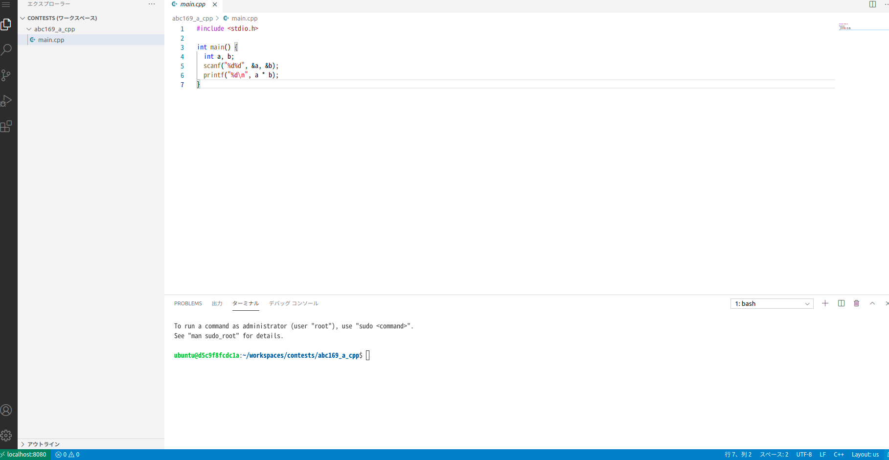

# Code-server container for Competitive Programming.


競技プログラミングの環境をコンテナにまとめたものです。



具体的には下記の言語のコンパイラ及び各種ツール一式がパックされており、ブラウザからコーディングできるようcode-serverを起動します。

- C/C++ (GCC/Clang)
- [code-server](https://github.com/cdr/code-server)
- [Online Judge Tools](https://github.com/online-judge-tools/oj)


## 使い方
```bash
docker build -t hayaten . 
docker run -d -p 8080:8080  \
--mount type=bind,source="<このリポジトリをcloneしたフォルダ>/.local/share/code-server",target="/home/ubuntu/.local/share/code-server"  \
hayaten
```
上記のコマンドを起動した後、ブラウザで http://localhost:8080 にアクセスする。


## 説明
- VSCodeの設定ファイルが起動するたびに消えるのは不便なため、VSCodeの設定ファイルのみマウントした状態で
Dockerを起動しています。
- DockerでのVSCodeの設定フォルダに該当する部分のフォルダに対しこのリポジトリの.local/share/code-serverフォルダにマウントして起動します。
- VSCodeの拡張機能はデフォルトで何も入っていないため、ブラウザのVSCodeから自分で拡張機能をインストールして下さい。

## この使い方のメリット
VSCodeに登録したスニペットやインストールした拡張機能が消えないこと。

## この使い方のデメリット
code-serverのログなど不要なファイルもマウント先のフォルダに溜まっていってしまいます。

## C++ による提出

(ABC169)[https://atcoder.jp/contests/abc169/tasks/abc169_a] のコードがサンプルとして abc196_a_cpp にあります。まず、Ctrl+Shift+@ により abc196_a_cpp でターミナルを開きます。


ターミナルが開いたら Online Judge Tools でテストケースをダウンロードします。
```bash
oj d https://atcoder.jp/contests/abc169/tasks/abc169_a
```

テストケースがダウンロードできたらコンパイルしテストしてみます。
```bash
g++ main.cpp && oj t
```
[+] test success: 2 cases とでたら成功です。


## 今後追加したい機能
- ACL環境


## 注意点
- 筆者は自分の手元環境のUbuntu18.04OS環境でしか試しておりません。
